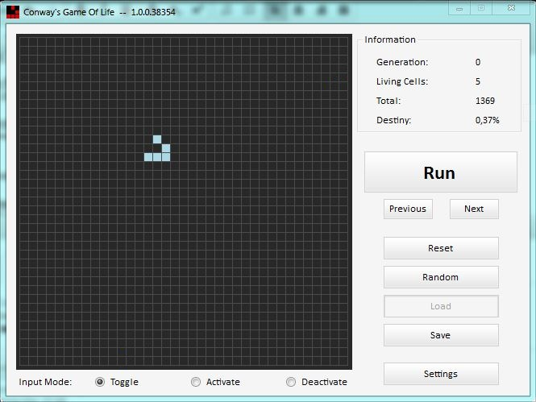
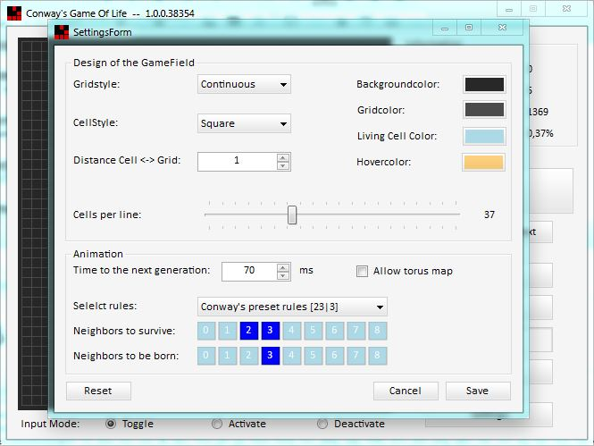
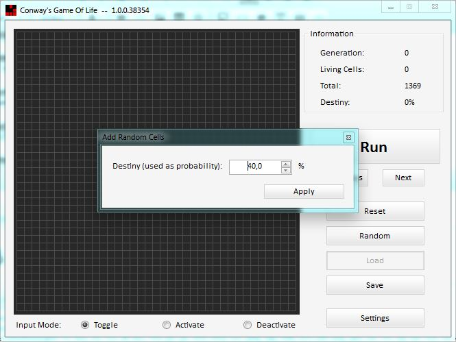
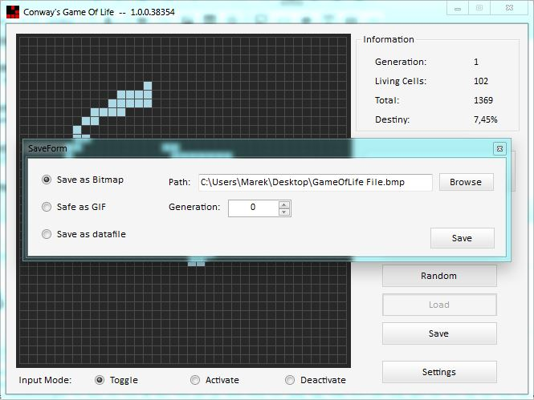
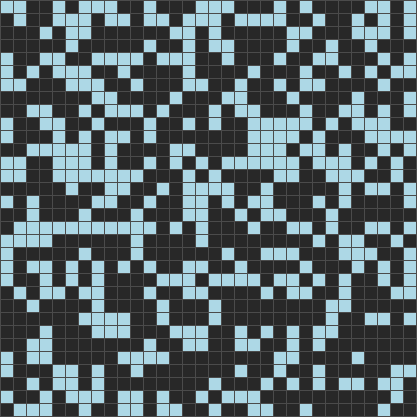

# Conway's Game Of Life

Conway's Game Of Life is a Windows WinForms implementation of the cellular automaton. Create cells manually, generate a random population, adjust the rules and appearance, step through generations, or run the simulation continuously.

## Screenshots

#### Main window


#### Settings


#### Random cells


#### Save options


#### Animation


## Use

- Select an input mode, then click cells on the game field to toggle, activate, or deactivate them.
- Choose **Random** to seed the field, or configure the grid, colours, animation speed, and rules in **Settings**.
- Use **Run**, **Next**, and **Previous** to control the simulation.
- Use **Save** to export a bitmap, GIF, or cell data file, and **Load** to open saved cell data.

Settings are stored in `%AppData%\Conway's Game Of Life`.

## Build

Build on Windows with the .NET 10 SDK:

```powershell
dotnet build GameOfLife.sln --configuration Release
```

Publish a self-contained Windows x64 release:

```powershell
dotnet publish GameOfLife/GameOfLife.csproj --configuration Release --output publish/win-x64
```

The self-contained output is written to `publish\win-x64\`. Run `GameOfLife.exe`; no .NET installation is required on the target computer.
